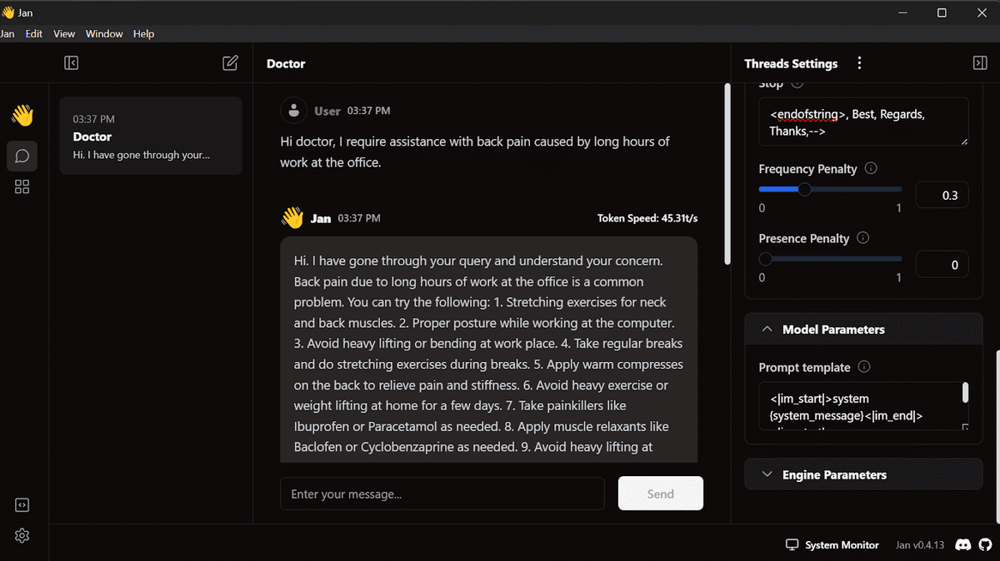

# Llama-3-8b-chat-doctor 🩺

A specialized medical conversation model built on top of Llama 3 8B Chat. This model is fine-tuned to provide medical advice and information while maintaining the base capabilities of Llama 3.


## Model Details

- **Base Model**: Llama 3 8B Chat
- **Architecture**: 8 billion parameter transformer model
- **Training**: Fine-tuned using PEFT (Parameter-Efficient Fine-Tuning)
- **Specialization**: Medical conversation and advice
- **Model Size**: ~16GB (split across 4 shards)

## Features

- Medical knowledge integration with Llama 3's general capabilities
- Conversation-style responses for medical queries
- Maintains the base model's chat format
- Optimized for medical terminology and explanations

## Running Locally

### Option 1: Using Jan

The simplest way to run this model locally is using Jan, an easy-to-use UI for running local language models:

1. Install Jan from [jan.ai](https://jan.ai)

2. Download the model:
   - Open Jan
   - Go to the Models tab
   - Search for "llama-3-8b-chat-doctor"
   - Click Download

3. Start chatting:
   - Go to the Chat tab
   - Select "llama-3-8b-chat-doctor" from the model dropdown
   - Start your medical conversation

Jan handles all the model management and provides a user-friendly interface without requiring any coding.

### Option 2: Using Hugging Face Transformers

For programmatic access or integration into your applications:

```python
from transformers import AutoModelForCausalLM, AutoTokenizer, pipeline
import torch

# Load model and tokenizer
tokenizer = AutoTokenizer.from_pretrained("Jenas-Anton/llama-3-8b-chat-doctor")
model = AutoModelForCausalLM.from_pretrained(
    "Jenas-Anton/llama-3-8b-chat-doctor",
    torch_dtype=torch.float16,
    device_map="auto"
)

# Create pipeline
pipe = pipeline(
    "text-generation",
    model=model,
    tokenizer=tokenizer,
    torch_dtype=torch.float16,
    device_map="auto"
)

# Format messages
messages = [{"role": "user", "content": "Hello doctor, I have bad acne. How do I get rid of it?"}]
prompt = tokenizer.apply_chat_template(messages, tokenize=False, add_generation_prompt=True)

# Generate response
outputs = pipe(
    prompt,
    max_new_tokens=120,
    do_sample=True,
    temperature=0.7,
    top_k=50,
    top_p=0.95
)
```

### Option 3: Using GGUF Format

For optimized inference using llama.cpp:

1. First, clone the llama.cpp repository and build it with CUDA support:
```bash
git clone --depth=1 https://github.com/ggerganov/llama.cpp.git
cd llama.cpp
# If using CUDA, ensure proper paths are set
sed -i 's|MK_LDFLAGS   += -lcuda|MK_LDFLAGS   += -L/usr/local/nvidia/lib64 -lcuda|' Makefile
LLAMA_CUDA=1 make -j
```

2. Install required Python packages:
```bash
pip install huggingface_hub
```

3. Download the model from Hugging Face:
```python
from huggingface_hub import snapshot_download
model_path = snapshot_download(repo_id="Jenas-Anton/llama-3-8b-chat-doctor")
```

4. Convert the model to GGUF format:
```bash
python /path/to/llama.cpp/convert_hf_to_gguf.py /path/to/downloaded/model \
    --outfile llama-3-8b-chat-doctor.gguf \
    --outtype f16
```

### Option 4: Using Kaggle Notebooks

The easiest way to try out the model without installing anything locally is using Kaggle notebooks:

1. Create a new Kaggle notebook with GPU acceleration:
   - Go to [kaggle.com](https://kaggle.com)
   - Create a new notebook
   - Enable GPU accelerator in notebook settings
   - Choose the latest Python environment

2. Install and convert the model:
```python
# Clone llama.cpp and build with CUDA support
!git clone --depth=1 https://github.com/ggerganov/llama.cpp.git
%cd llama.cpp
!sed -i 's|MK_LDFLAGS   += -lcuda|MK_LDFLAGS   += -L/usr/local/nvidia/lib64 -lcuda|' Makefile
!LLAMA_CUDA=1 make -j

# Install required packages
!pip install huggingface_hub

# Download the model
from huggingface_hub import snapshot_download
model_path = snapshot_download(repo_id="Jenas-Anton/llama-3-8b-chat-doctor")

# Convert to GGUF format
!python convert_hf_to_gguf.py {model_path} \
    --outfile llama-3-8b-chat-doctor.gguf \
    --outtype f16
```

3. Run inference using the generated GGUF file with llama.cpp

Advantages of using Kaggle:
- Free GPU access
- Pre-installed deep learning environment
- Persistent storage for converted models
- Shareable notebooks for collaboration
- No local hardware requirements

## Model Creation Process

This model was created by merging a medical-domain adapter with the Llama 3 8B Chat base model. Here's the process:

```python
from transformers import AutoModelForCausalLM, AutoTokenizer
from peft import PeftModel
import torch
from trl import setup_chat_format

# Load base model and tokenizer
tokenizer = AutoTokenizer.from_pretrained(base_model)
base_model = AutoModelForCausalLM.from_pretrained(
    base_model,
    return_dict=True,
    low_cpu_mem_usage=True,
    torch_dtype=torch.float16,
    trust_remote_code=True,
)

# Setup chat format
base_model, tokenizer = setup_chat_format(base_model, tokenizer)

# Merge adapter with base model
model = PeftModel.from_pretrained(base_model, "Jenas-Anton/llama-3-8b-chat-doctor")
model = model.merge_and_unload()
```

## Requirements

- transformers
- torch
- accelerate
- peft
- trl
- bitsandbytes (for optimization)

## Installation

```bash
pip install -U transformers torch accelerate peft trl bitsandbytes
```

## Hardware Requirements

- GPU with at least 16GB VRAM for inference
- Approximately 32GB system RAM
- For deployment, consider using GPU acceleration
- Alternatively, use Kaggle's free GPU resources

## Limitations

- This model is for informational purposes only and should not replace professional medical advice
- Responses should be verified by healthcare professionals
- May have limitations in understanding complex medical conditions
- Should be used as a supplementary tool rather than primary diagnostic source

## License

This model follows the licensing terms of the original Llama 3 model. Please refer to Meta's Llama licensing terms for usage restrictions and requirements.


## Model Card

The model is available on the Hugging Face Hub at [Jenas-Anton/llama-3-8b-chat-doctor](https://huggingface.co/Jenas-Anton/llama-3-8b-chat-doctor).

## Acknowledgments

- Thanks to Meta AI for the base Llama 3 model
- Thanks to the Hugging Face team for their transformers library and model hosting
- Thanks to the PEFT library developers for enabling efficient fine-tuning
- Thanks to the llama.cpp team for providing efficient inference capabilities
- Thanks to the Jan.ai team for making local AI models accessible
- Thanks to Kaggle for providing free GPU resources and notebook environments

## Contributing

Contributions are welcome! Please feel free to submit a Pull Request.

## Development Notes

- The model is split into 4 shards for efficient loading and distribution
- Uses 16-bit floating point precision (float16) for reduced memory usage
- Implements chat templating for consistent conversation format
- Leverages the TRL library for chat formatting setup
- Multiple deployment options available: local installation, Kaggle notebooks, or cloud deployment
